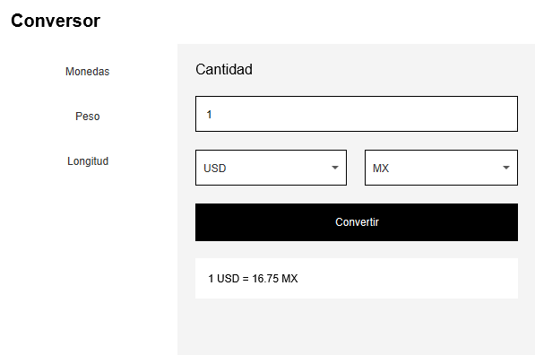

<h1 align=center>CONVERSOR DE DIVISAS</h1>
<h4 align=center>CHALLENGE ORACLE ONE</h4>

  <h3>
    <a href="https://github.com/ErikaAX08/conversor-alura" target="_blank">
      Solución
    </a>
     | 
    <a href="https://www.aluracursos.com/challenges/oracle-one-back-end/conversordemoneda/sprint01" target="_blank">
      Challenge
    </a>
  </h3>

## Vista previa

### Redes sociales

- [Erika AX](https://erikaax.com)
- [GitHub](https://github.com/ErikaAX08)
- [Fiverr](https://es.fiverr.com/erikaax08)
- [Twitter](https://twitter.com/ErikaAX08)
- [LinkedIn](https://www.linkedin.com/in/erikaax/)
- [Instagram](https://www.instagram.com/erikaax08/)
